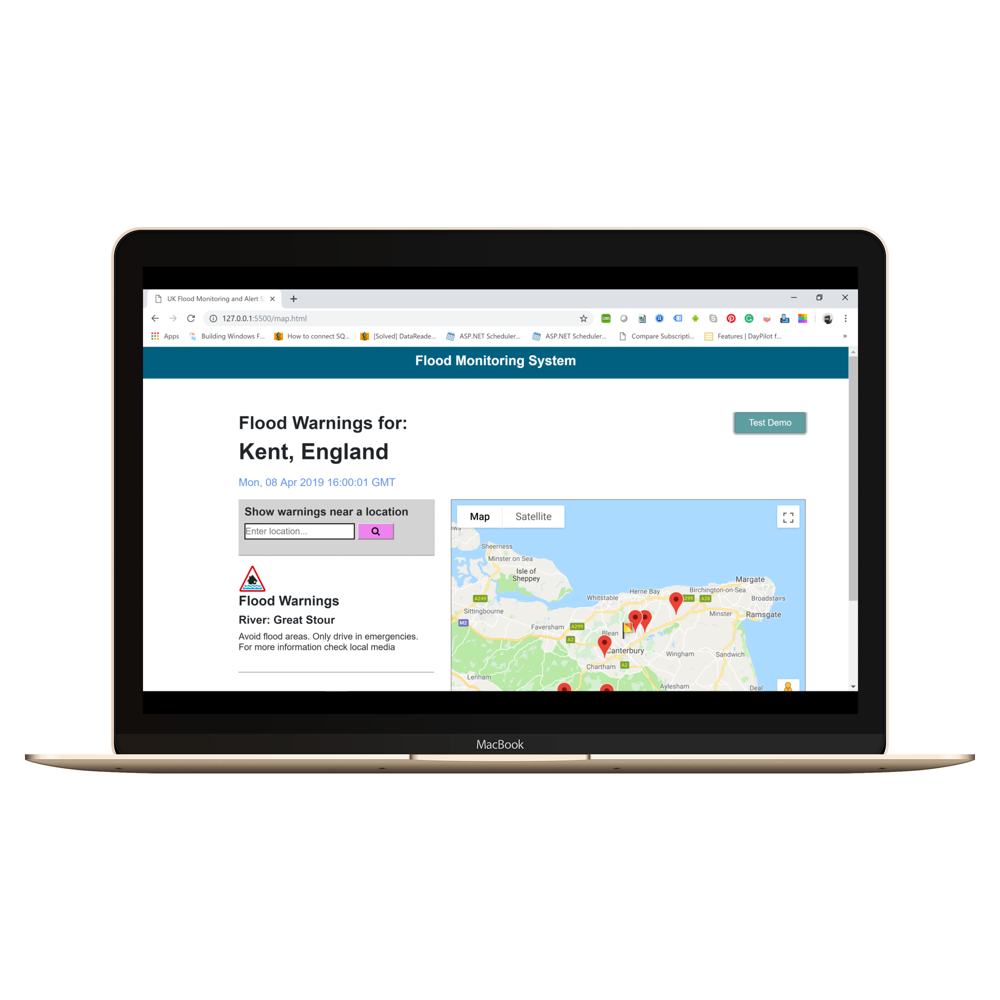
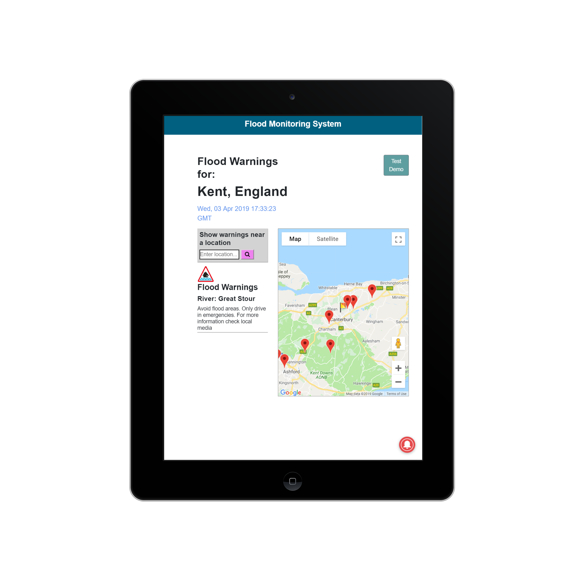

# Flood Monitoring and Alert System
A flood monitoring and alert system, that displays present and historical water levels graphically across the UK and also gives flood alerts and warnings.

# Getting Started
Clone the project with the command **git clone https://github.com/NihinFaj/Flood_Mapping_System**

# Prerequisites
A web browser (E.g Google Chrome)
An IDE (E.g Visual Studio Code)

# Built With
1. Visual Studio Code - The IDE used 
2. HTML, CSS, Javascript, Bootstrap - Languages and Frameworks

# Authors 
1. Nihinlolamiwa Fajemilehin
2. Timothy Shirgba

# Functionalities
On load of the web application, flood stations from areas around the UK are read from a web server and displayed on the map as markers. when a marker is clicked on, the present and historical water levels of that flood station is plotted on a graph, showing the flood value levels against the day and time of the reading.

# Images

# Note
This project depends on a backend server that would not be up when you clone/download this project and try to run it. Therefore, you would not be able to try out all the functionalities of this project.
